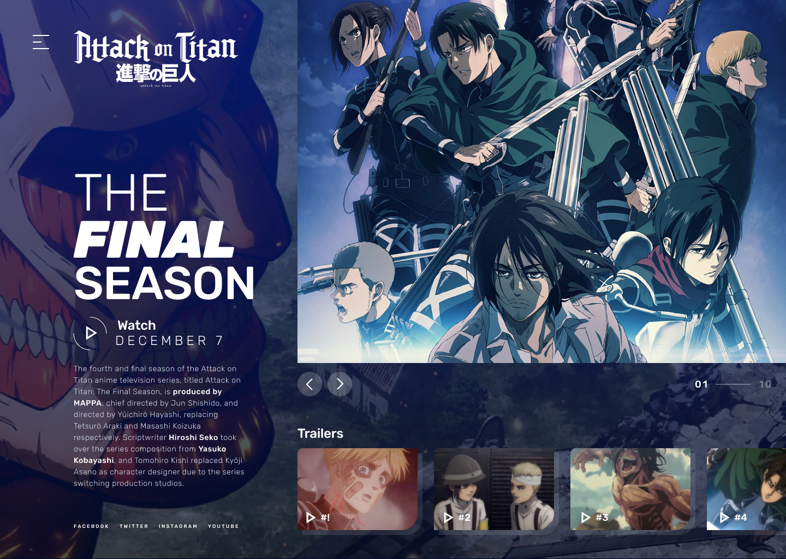

# Landing Page Attack on Titan

Esse projeto é uma landing page baseado no anime "Attack on Titan" no layout e uma plataforma de filmes, séries e animes.

## Tecnologias utilizadas:
- React
- Typescript
- Styled Components

Você pode ver o projeto funcionado aqui: [Landing Page - Attack on Titan](https://attackontitan-anime.vercel.app/)

## Layout




## 🚀 Começando

Pra começar, primeiro clone o repositório do projeto pra sua máquina

```
$ git clone https://github.com/Vinicius-Rubia/landing_page_attack_on_titan.git
```

## ⚙️ Iniciando o Projeto

Para iniciar, execute os seguintes comandos em seu terminal:

```
$ cd landing_page_attack_on_titan -> Mudar para o diretório do projeto
```

```
$ npm install -> Instalar todas as dependências

ou então...

$ yarn -> Instalar todas as dependências
```

```
$ npm run dev -> Iniciar o projeto

ou então...

$ yarn run dev -> Iniciar o projeto
```
Creditos: Design utilizado no projeto foi criado pela comunidade do Figma

⌨️ com ❤️ por [Vinicius Rubia](https://github.com/Vinicius-Rubia) 😊
